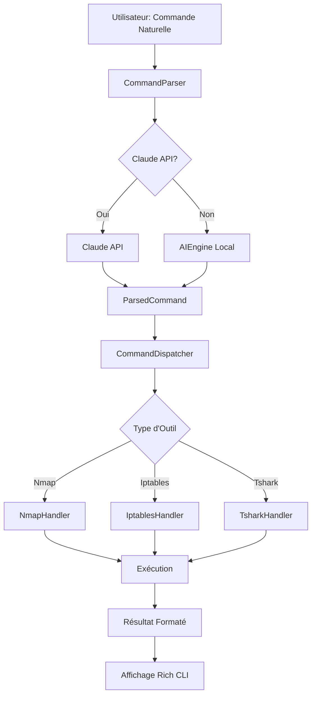

<div align="center">

# 🛡️ NetworkSearcherAI

### 🤖 Orchestrateur d'Outils de Cybersécurité Propulsé par l'IA

[](https://www.python.org/)
[](LICENSE)
[](https://www.anthropic.com/)
[](https://github.com)

**Parlez en français naturel, l'IA exécute vos commandes de cybersécurité** 🚀

[Fonctionnalités](#-fonctionnalités) • [Installation](#-installation-rapide) • [Documentation](#-documentation) • [Contribuer](#-contribuer)

---

</div>

## 📋 Table des Matières

- [✨ Aperçu](#-aperçu)
- [🎯 Fonctionnalités](#-fonctionnalités)
- [🛠️ Technologies](#️-technologies)
- [⚡ Installation Rapide](#-installation-rapide)
- [🚀 Utilisation](#-utilisation)
- [📖 Exemples](#-exemples)
- [🏗️ Architecture](#️-architecture)
- [🧠 Intelligence Artificielle](#-intelligence-artificielle)
- [🔧 Configuration](#-configuration)
- [📊 Outils Supportés](#-outils-supportés)
- [🤝 Contribuer](#-contribuer)
- [⚠️ Sécurité & Légalité](#️-sécurité--légalité)
- [📄 Licence](#-licence)

---

## ✨ Aperçu

**NetworkSearcherAI** est un orchestrateur intelligent qui transforme vos demandes en langage naturel en commandes de cybersécurité exécutables. Plus besoin de mémoriser les syntaxes complexes de `nmap`, `iptables`, `tshark` ou autres outils - **parlez simplement, l'IA comprend et exécute**.

### 🎬 Démonstration

```bash
# Au lieu de taper :
nmap -A -sV -O -Pn 192.168.1.20

# Dites simplement :
python orchestrator.py "scan cette IP 192.168.1.20 et trouve tout ce qui est utile"
```

### 🌟 Points Forts

- 🧠 **IA Avancée** : Utilise Claude API ou un moteur NLP local (TF-IDF + embeddings)
- 🎨 **Interface Moderne** : CLI animée avec Rich pour une expérience utilisateur premium
- 🔍 **Détection Automatique** : Identifie l'outil approprié même sans le mentionner explicitement
- 🛡️ **Sécurisé** : Mode simulation pour tester sans risque
- ⚡ **Auto-installation** : Détecte et installe automatiquement les outils manquants
- 🌍 **Français Natif** : Comprend parfaitement le français naturel

---

## 🎯 Fonctionnalités

### 🤖 Intelligence Artificielle

| Fonctionnalité | Description |
|----------------|-------------|
| **Classification d'Intention** | Utilise TF-IDF et embeddings sémantiques pour comprendre l'intention |
| **Extraction d'Entités (NLP)** | Identifie automatiquement IPs, domaines, ports, protocoles, etc. |
| **Scoring de Confiance** | Évalue la probabilité que l'outil détecté soit le bon |
| **Compréhension Contextuelle** | Analyse le contexte sémantique des mots-clés et actions |

### 🎨 Interface Utilisateur

- ✨ **CLI Animée** : Interface terminal moderne avec animations et couleurs
- 📊 **Affichage Structuré** : Résultats formatés avec Rich (panels, syntax highlighting)
- 🔄 **Mode Interactif** : Session continue pour exécuter plusieurs commandes
- 🎯 **Mode Simulation** : Testez vos commandes sans les exécuter réellement

### 🔧 Fonctionnalités Techniques

- 🔄 **Auto-détection d'outils** : Détecte et installe automatiquement les dépendances
- 🛡️ **Gestion d'erreurs** : Gestion robuste des erreurs avec messages clairs
- 📝 **Génération de commandes** : Crée des commandes optimisées et sécurisées
- 🔍 **Analyse intelligente** : Interprète les résultats et fournit des recommandations

---

## 🛠️ Technologies

<div align="center">


</div>

### Stack Technique

- **Langage** : Python 3.7+
- **IA** : Anthropic Claude API (optionnel) + Moteur NLP local
- **Interface** : Rich (CLI moderne)
- **Outils** : Nmap, Iptables, Tshark/Tcpdump, Dig, Whois
- **NLP** : TF-IDF, Extraction d'entités, Classification sémantique

---

## ⚡ Installation Rapide

### 📦 Prérequis

Assurez-vous d'avoir Python 3.7+ installé :

```bash
python3 --version
```

### 🚀 Installation en 3 Étapes

#### 1️⃣ Cloner le Repository

```bash
git clone https://github.com/votre-username/NetworkSearcherAI.git
cd NetworkSearcherAI
```

#### 2️⃣ Installer les Dépendances Python

```bash
pip install -r requirements.txt
```

#### 3️⃣ Configurer l'API Claude (Optionnel)

Créez un fichier `config.json` :

```json
{
  "claude_api_key": "votre_cle_api_anthropic"
}
```

> 💡 **Note** : Le système fonctionne aussi sans Claude API en utilisant le moteur NLP local.

### 🔧 Installation des Outils Système

Le système peut installer automatiquement les outils manquants, ou vous pouvez les installer manuellement :

<details>
<summary><b>🐧 Linux (Debian/Ubuntu)</b></summary>

```bash
sudo apt-get update
sudo apt-get install -y nmap iptables tshark dnsutils whois tcpdump
```

</details>

<details>
<summary><b>🍎 macOS</b></summary>

```bash
brew install nmap tshark bind whois tcpdump
```

</details>

<details>
<summary><b>🪟 Windows</b></summary>

```powershell
# Utilisez WSL ou installez les outils individuellement
# Nmap: https://nmap.org/download.html
# Wireshark (inclut tshark): https://www.wireshark.org/download.html
```

</details>

---

## 🚀 Utilisation

### 🎯 Mode Interactif (Recommandé)

Lancez une session interactive :

```bash
python orchestrator.py --interactive
# ou
python orchestrator.py -i
```

Vous pouvez ensuite taper vos commandes naturellement :

```
> scan cette IP 192.168.1.20
> capture le trafic DNS pendant 10 secondes
> bloque cette IP 1.2.3.4
```

### 💻 Mode Ligne de Commande

Exécutez une commande unique :

```bash
python orchestrator.py "scan cette IP 192.168.1.20 et trouve tous les ports ouverts"
```

### 🧪 Mode Simulation

Testez vos commandes sans les exécuter :

```bash
python orchestrator.py --simulate "bloque cette IP 1.2.3.4"
```

### 📋 Options Disponibles

| Option | Description |
|--------|-------------|
| `--interactive` / `-i` | Lance le mode interactif |
| `--simulate` / `--sim` | Mode simulation (pas d'exécution réelle) |
| `--help` / `-h` | Affiche l'aide |

---

## 📖 Exemples

### 🔍 Nmap - Scan de Réseau

**Commande naturelle :**
```bash
python orchestrator.py "scan cette IP 192.168.1.20 et trouve tout ce qui est utile"
```

**Commande générée :**
```bash
nmap -A -sV -O -Pn 192.168.1.20
```

**Résultat :**
- ✅ Détection OS
- ✅ Version des services
- ✅ Scripts NSE
- ✅ Analyse complète

---

### 🛡️ Iptables - Configuration Firewall

**Commande naturelle :**
```bash
python orchestrator.py "bloque toutes les connexions entrantes sauf SSH"
```

**Commande générée :**
```bash
iptables -A INPUT -p tcp --dport 22 -j ACCEPT
iptables -A INPUT -j DROP
```

---

### 📡 Tshark - Capture de Trafic

**Commande naturelle :**
```bash
python orchestrator.py "capture le trafic DNS pendant 10 secondes"
```

**Commande générée :**
```bash
sudo tshark -i any -f "udp port 53" -a duration:10
```

---

### 🌐 Dig - Requête DNS

**Commande naturelle :**
```bash
python orchestrator.py "résous le DNS pour google.com"
```

**Commande générée :**
```bash
dig A google.com +noall +answer
```

---

### 🔎 Whois - Informations Domaine

**Commande naturelle :**
```bash
python orchestrator.py "analyse ce domaine example.com"
```

**Commande générée :**
```bash
whois example.com
```

---

## 🏗️ Architecture

```
NetworkSearcherAI/
│
├── 🎯 orchestrator.py          # Point d'entrée principal
│
├── 🤖 ai_engine.py             # Moteur IA local (TF-IDF + NLP)
│   ├── IntentClassifier        # Classification d'intention
│   ├── EntityExtractor         # Extraction d'entités
│   └── AIEngine                # Orchestrateur IA
│
├── 🧠 ai/
│   └── claude_api.py           # Intégration Claude API
│
├── 🔧 core/
│   ├── parsing.py              # Analyse des commandes
│   ├── dispatcher.py           # Dispatch vers les handlers
│   └── package_manager.py      # Gestion des packages
│
├── 🎨 interfaces/
│   ├── cli_animated.py         # CLI moderne avec Rich
│   └── cli.py                  # CLI basique
│
└── 🛠️ tools/
    ├── base_tool.py            # Classe de base abstraite
    ├── base_handler.py         # Handler de base
    ├── nmap_handler.py         # Handler Nmap
    ├── iptables_handler.py     # Handler Iptables
    ├── tshark_handler.py       # Handler Tshark
    ├── dig_tool.py             # Outil Dig
    └── whois_tool.py           # Outil Whois
```

### 🔄 Flux d'Exécution



---

## 🧠 Intelligence Artificielle

### 🎯 Comment ça Fonctionne ?

#### 1. Classification d'Intention

Le système utilise des **embeddings sémantiques** et **TF-IDF** pour classer l'intention :

```python
Input: "Je veux scanner tous les ports ouverts de cette machine 192.168.1.20"

Analyse IA:
├── Mots-clés: "scanner", "ports", "ouverts" → score nmap: 0.85
├── Action: "scanner" → score nmap: 0.90
├── Contexte: "machine", "réseau" → score nmap: 0.80
└── Résultat: nmap avec confiance 0.87
```

#### 2. Extraction d'Entités

Utilise du **NLP (Natural Language Processing)** pour extraire :

- ✅ Adresses IP (`192.168.1.20`)
- ✅ Domaines (`example.com`)
- ✅ Ports (`22`, `80`, `443`)
- ✅ Protocoles (`TCP`, `UDP`, `DNS`, `HTTP`)
- ✅ Durées (`10 secondes`, `5 minutes`)
- ✅ Interfaces réseau (`eth0`, `wlan0`, `any`)

#### 3. Génération de Commande

Combine l'intention et les entités pour générer la commande optimale :

```python
Intention: nmap (confiance: 0.87)
Entités: {ip: "192.168.1.20", action: "scan complet"}
→ Commande: nmap -A -sV -O -Pn 192.168.1.20
```

### 🔄 Modes d'IA

| Mode | Description | Avantages |
|------|-------------|-----------|
| **Claude API** | Utilise Anthropic Claude | Compréhension contextuelle avancée |
| **NLP Local** | Moteur TF-IDF + Extraction | Rapide, pas de dépendance externe |

---

## 🔧 Configuration

### 📝 Fichier `config.json`

```json
{
  "claude_api_key": "sk-ant-api03-..."
}
```

### 🔑 Obtenir une Clé API Claude

1. Visitez [console.anthropic.com](https://console.anthropic.com)
2. Créez un compte ou connectez-vous
3. Générez une clé API
4. Ajoutez-la dans `config.json`

> ⚠️ **Sécurité** : Ne commitez jamais votre `config.json` avec votre clé API réelle !

---

## 📊 Outils Supportés

| Outil | Description | Détection Auto | Exemple |
|-------|-------------|----------------|---------|
| **🔍 Nmap** | Scan de ports et services | ✅ | "scan cette IP 192.168.1.1" |
| **🛡️ Iptables** | Configuration firewall | ✅ | "bloque cette IP 1.2.3.4" |
| **📡 Tshark** | Capture de trafic réseau | ✅ | "capture le trafic DNS" |
| **🌐 Dig** | Requêtes DNS | ✅ | "résous google.com" |
| **🔎 Whois** | Informations domaine/IP | ✅ | "analyse example.com" |
| **📦 Tcpdump** | Capture de paquets | ✅ | "capture les paquets" |

---

## 🤝 Contribuer

Les contributions sont les bienvenues ! 🎉

### 🚀 Comment Contribuer ?

1. **Fork** le projet
2. **Créez** une branche pour votre fonctionnalité (`git checkout -b feature/AmazingFeature`)
3. **Commitez** vos changements (`git commit -m 'Add some AmazingFeature'`)
4. **Push** vers la branche (`git push origin feature/AmazingFeature`)
5. **Ouvrez** une Pull Request

### 📋 Guidelines

- ✨ Ajoutez des tests pour les nouvelles fonctionnalités
- 📝 Documentez votre code
- 🎨 Suivez le style de code existant
- ✅ Assurez-vous que tous les tests passent

### 🐛 Signaler un Bug

Ouvrez une [issue](https://github.com/votre-username/NetworkSearcherAI/issues) avec :
- Description du bug
- Steps to reproduce
- Comportement attendu vs actuel
- Environnement (OS, Python version)

---

## ⚠️ Sécurité & Légalité

### 🛡️ Avertissements Importants

- ⚠️ **Privilèges** : Certaines commandes nécessitent `sudo` (iptables, tcpdump, tshark)
- ⚖️ **Autorisation** : Assurez-vous d'avoir l'autorisation légale avant d'analyser des systèmes tiers
- 🧪 **Test uniquement** : Utilisez uniquement sur vos propres systèmes ou avec autorisation explicite
- 🚫 **Pas de destruction** : Le système ne génère jamais de commandes destructives

### 📜 Responsabilité

Ce projet est fourni à des fins **éducatives et de test**. L'utilisation de ce logiciel pour analyser des systèmes sans autorisation est **illégale** et peut entraîner des poursuites pénales.

**Utilisez de manière responsable et légale.** ⚖️

---

## 📄 Licence

Ce projet est sous licence **MIT**. Voir le fichier [LICENSE](LICENSE) pour plus de détails.

---

## 🙏 Remerciements

- [Anthropic](https://www.anthropic.com/) pour Claude API
- [Rich](https://github.com/Textualize/rich) pour l'interface CLI moderne
- La communauté open-source pour les outils de cybersécurité

---

<div align="center">

### ⭐ Si ce projet vous plaît, n'hésitez pas à lui donner une étoile ! ⭐

**Fait avec ❤️ par la communauté**

[⬆ Retour en haut](#-networksearcherai)

</div>
